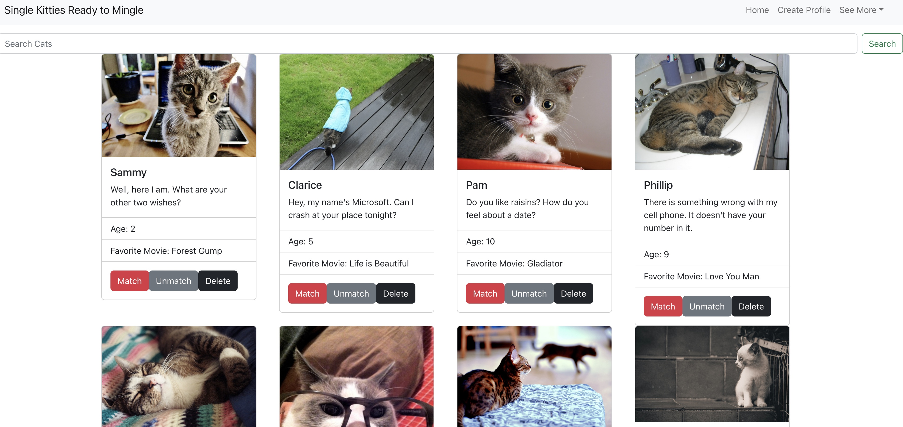
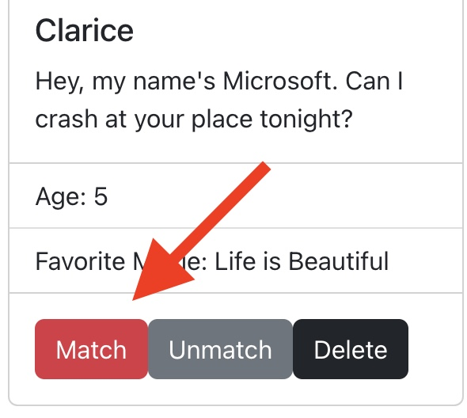
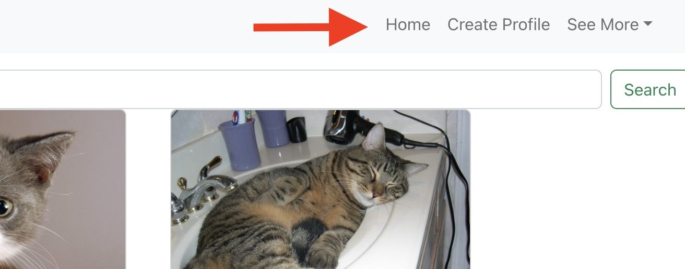
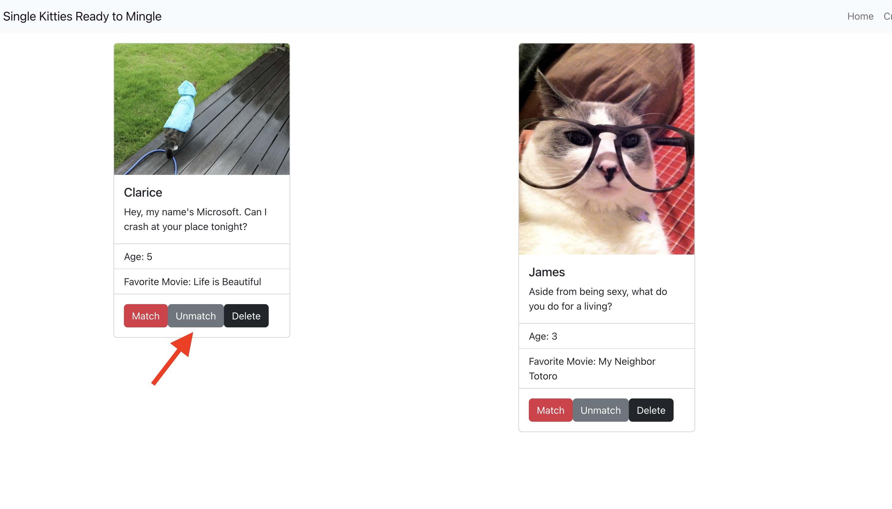
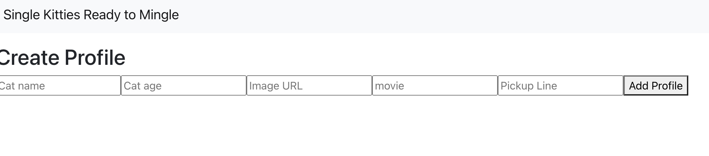

Welcome to the best Cat Dating App on the web!

Read through for a high level overview of the site and the navigational features.

When the site first loads you are greated with a Navigation bar, search bar, and list of cats with active dating proviles. Scan through the profiles and you will have access to a profile picture and some basic information about the cats who are single and ready to mingle.

The next step is to start finding your matches. To do this, it's as easy as clicking the red "match" button from the home page. 

Once you have clicked "match", the cat profile you have matched with will be removed from the home page. To view all your matches, you can use the navigation bar to select "See More", and then click "Matches" to view only the list of cats you've matched with.

If you change your mind about a particular cat, you can remove them from the Matched page by clicking the "Unmatch" button.

If you would like to make your own dating profile, you can do that to! Navigating to the "Create Profile" screen will give you the option to build your own cat dating profile card that will appear on the home screen for all to see.

In the same "See More" dropdown menu, you can also navigate to a "learn more" page, which offers three tabs of information on the website, its founder, and contact information.

Last but not least, if you leave the page and come back later but have one cat in mind that stuck with you, you can use the "Search" bar to find that exact can based on a search of their name.

Enjoy and good luck finding true love!
